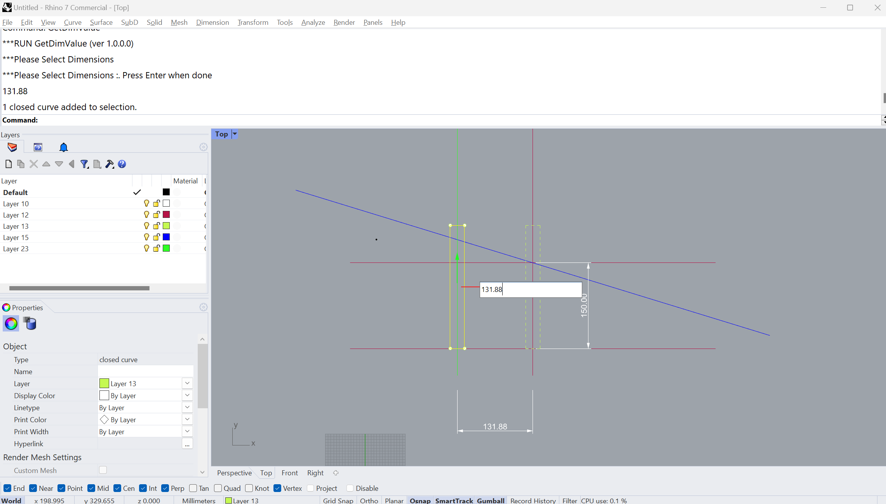

# 20240717_GET_DIM_VALUE_COMMAND


これの派生形です↓  
[https://github.com/viccBlog/20240131_GET_LAYER_COMMAND](https://github.com/viccBlog/20240131_GET_LAYER_COMMAND)  


指定したディメンションの数値をクリップボードに貼るコマンド。

オブジェクトを選んだ状態（複数可）で `GetDimValue` を実行 >> クリップボードにディメンションの数値がテキストとしてが入ります。  
オブジェクトが選ばれていない状態で `GetDimValue` を実行 >> オブジェクトを選ぶように促されるのでオブジェクトを選ぶと（複数可）、クリップボードにテキストとしてディメンションの数値が入ります。  

想定としては、動かしたい箇所の寸法を `Dim` コマンドで計測し、その寸法を利用してオブジェクトを移動することなどを想定しています。計った箇所を後で確認できない `Distance` コマンドを吉岡があまり利用しないので、ディメンションの数値を取得するコマンドとなっています。Distance 派の人はこのプログラムを改変し GetDistance コマンドなど作ってみてもいいのかもしてません。    

※ライノの実装について補足説明  
ディメンションオブジェクトには、Dimension Text と Dimension Value という似たようなプロパティが存在します。Dimension Value の方は距離の実寸法（下の画像では例えば 131.88030294 というような数値）で、Dimension Text はディメンションで表示されているテキスト（下の画像では 131.88 という数値）です。建設業において過度な精度管理は不必要なので、このコマンドでは Dimension Text の方を採用しています。コマンド名は `GetDimValue` なので少し紛らわしいです（数値を取得するのはテキストではないので直観的な覚えやすさで `GetDimValue` としています）。  

  


## インストール  

下の URL から rhi をダウンロードして、ダブルクリック。その後、ライノの再起動で反映されるはずです。  
エラーが出たら教えてください。。。  
[https://github.com/viccBlog/20240717_GET_DIM_VALUE_COMMAND/releases](https://github.com/viccBlog/20240717_GET_DIM_VALUE_COMMAND/releases)  


※うまく動かなければ、それぞれもマシン上で RhinoPython エディタからコンパイルも可能です。  
プログラムはこんな感じ。  
[https://github.com/viccBlog/20240717_GET_DIM_VALUE_COMMAND/blob/main/GetDimValue_cmd.py](https://github.com/viccBlog/20240717_GET_DIM_VALUE_COMMAND/blob/main/GetDimValue_cmd.py)  


インストール先はここ。何かあればここを確認する。  
```
C:\Users\USER_NAME\AppData\Roaming\McNeel\Rhinoceros\7.0\Plug-ins\PythonPlugins
```


## 動作環境  

下記の環境で動作確認しています。  
- Windows11 + Rhino7 SR36  


## モチベーション

これとほぼ同様です  
[https://github.com/viccBlog/20240131_GET_LAYER_COMMAND?tab=readme-ov-file#%E3%83%A2%E3%83%81%E3%83%99%E3%83%BC%E3%82%B7%E3%83%A7%E3%83%B3](https://github.com/viccBlog/20240131_GET_LAYER_COMMAND?tab=readme-ov-file#%E3%83%A2%E3%83%81%E3%83%99%E3%83%BC%E3%82%B7%E3%83%A7%E3%83%B3)  

ライノでのマニュアル作業や、gh で何ミリ move したいというパネルへの書き込みなどの利用を想定しています。  


## アルゴリズム  

```mermaid
graph TD
  Start((Run: GetDimValue))-->B{選択状態のオブジェクトを取得}
  B--オブジェクト有り--> C[オブジェクトがディメンションであれば数値を取得]
  C-->D[ディメンションの数値の文字列から重複テキストを削除]
  D-->E[ディメンションの数値の文字列をクリップボードに貼り付け]
  E--> Z((END))
  B--オブジェクト無し--> F((オブジェクトの選択を待つ))
  F-->G{選択状態のオブジェクトを取得}
  G--オブジェクト有り--> CC(オブジェクトがディメンションであれば数値を取得)
  CC-->DD(ディメンションの数値の文字列から重複テキストを削除)
  DD-->EE(ディメンションの数値の文字列をクリップボードに貼り付け)
  EE--> Z
  G--オブジェクト無し--> Z
  F--コマンドをキャンセル--> Z
```


## Release Note  

- v1  
  - first release  


## ref  

- “copy text to clipboard” component?  
  - [https://discourse.mcneel.com/t/copy-text-to-clipboard-component/81366](https://discourse.mcneel.com/t/copy-text-to-clipboard-component/81366)  

- Creating Rhino Commands Using Python  
  - [https://developer.rhino3d.com/guides/rhinopython/creating-rhino-commands-using-python/#windows](https://developer.rhino3d.com/guides/rhinopython/creating-rhino-commands-using-python/#windows)  

- Create RHI File  
  - [https://developer.rhino3d.com/guides/rhinopython/creating-rhino-commands-using-python/#creating-an-rhi-installer](https://developer.rhino3d.com/guides/rhinopython/creating-rhino-commands-using-python/#creating-an-rhi-installer)  

